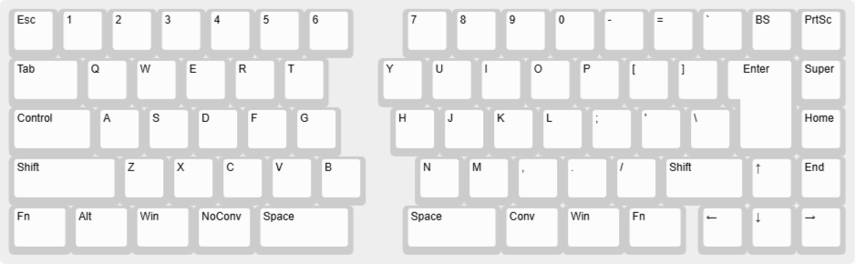

<h1 align="center">

Just the Two of JIS [](/LICENSE)

</h1>

<div align="center">

**_We can make it if we try ..._**

</div>

## Concept / Spec

テンキーレスをそのまま2つに割ったような、シンプルな分割キーボード

|                 |                            |
| --------------- | :------------------------- |
| 配列            | US ＋ 変換キー，無変換キー |
| Enterキー       | ISO                        |
| 接続方法        | 有線のみ（USB Type-C）     |
| ホットスワップ  | 対応                       |
| リマッピング    | 対応（Vial）               |
| LEDライティング | 非対応                     |

## Layers

### #1 (default)



### #2

`Fn`キーを押している間だけ起動。

### #3 (MIDI mode)

`M`キーを押しながら電源を投入することで起動。電源を落とすと自動的に終了。

## Note

```
The firmware size is fine - 27342/28672 (95%, 1330 bytes free)
```
