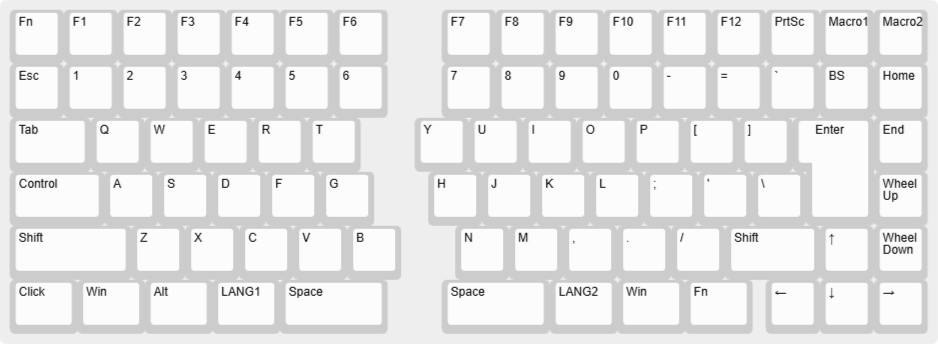

<h1 align="center">

Just the Two of ~~US~~ JIS

</h1>

**_We can make it if we try ..._**

## Spec

| 項目            | 仕様                                                                                           |
| --------------- | ---------------------------------------------------------------------------------------------- |
| 接続・給電      | USB Type-C                                                                                     |
| レイアウト      | ロープロファイル **JIS-like US** 87キー                                                    |
| キーマップ変更  | ✅ - [Vial](https://get.vial.today/), [Pipette](https://github.com/darakuneko/pipette-desktop) |
| ホットスワップ  | ✅                                                                                             |
| LEDライティング | ✅                                                                                             |

## BOM

| 部品                           |        数量 |
| ------------------------------ | ----------: |
| PCB基板                        |     左右1組 |
| Kailh Choc V2 キースイッチ     |        87個 |
| Kailh Choc V2 HotSwapソケット  |        87個 |
| Kailh Choc V2 スタビライザー   |         4個 |
| SK6812MINI-E フルカラーLED     |        87個 |
| ケース                         | 左右上下1組 |
| M2 12mmタップねじ              |        42本 |
| ロープロファイル用キーキャップ |         1組 |
| 3.5mm TRRSケーブル             |         1本 |
| USB Type-Cケーブル             |         1本 |

## Notice

- 故障を避けるため、TRRSケーブルの着脱はUSB Type-Cケーブルを抜いた状態で行ってください。
- コンパイルの際は、Vial-QMKリポジトリにおける下記ファイルを手元で編集する必要があります。
  - `/quantum/action.c`
  - `/quantum/action_tapping.c`
  - `/quantum/action_tapping.h`

  詳細: 準備中
